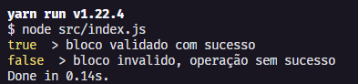

# Blockchain-with-javascript
> Implementação do conceito de blockchain com javascript
             
                                     

## O que é blockchain ? 

blockchain é um sistema que permite rastrear, o enviar e receber alguns tipos de dados pela internet. São pedaços de código gerados online que carregam informações, semelhante a blocos. Cada bloco é formado por si, e pelo anterior. Dessa forma permanecem conectados. Por isso o nome blockchain( corrente de blocos ).

## Segurança

Os dados desses blocos possuem um código complexo de letras e números, o que garante uma segurança maior.

Outro fator importante é o fato de cada bloco possuir o seu código e o código do anterior. Caso haja uma tentativa de quebrar esse código, teria que ser decodificado não apenas um, mas os dois blocos.

A blockchain não possuiu dono, mas possui um registro público que pode ser acessado por qualquer um. Não é possível ver o conteúdo, ou seja, os dados codificados.


## Instalação

Baixe ou clone o repositório para ter acesso ao código e desenvolver.

no seu editor de código preferencial, abra o terminal e digite:

### NPM

```sh
npm install
```

### yarn

```sh
yarn install
```

essa ação irá instalar os seguintes módulos:

"crypto-js": "^4.0.0"

## Configuração para Desenvolvimento

Depois de instalado os módulos, execute o script criado para inicializar o projeto: 

### NPM

```sh
npm dev
```
### yarn

```sh
yarn dev
```

no estado atual, aparecerá no seu terminal dois console.log(). Um true e um false

O true é o retorno da validação do bloco como positivo, indicado que a operação foi bem sucedida e não ouve problemas.

após esse evento, foi simulado um ataque malicioso por algum indivíduo. Depois do ataque ocorrido o bloco é verificado de novo, só que desta vez, como foi violado, a operação vai retornar false e o bloco não vai ser validado na rede e ganhar seu registro.

 

deixei um if, com as duas condições( com ataque e sem ataque), caso queira testar. Se quiser remover o ataque, simplesmente remova a linha:

```sh
blockchain.blocks[1].data.amount = 30000
```

alterar o amount de 30000 para 4 também vai obter o mesmo resultado.


qualquer duvida ou sugestão:


Matheus de Oliveira Mendonça – [@MathSilms](https://www.linkedin.com/in/mathsilms/) – Mateheusoliver@gmail.com
